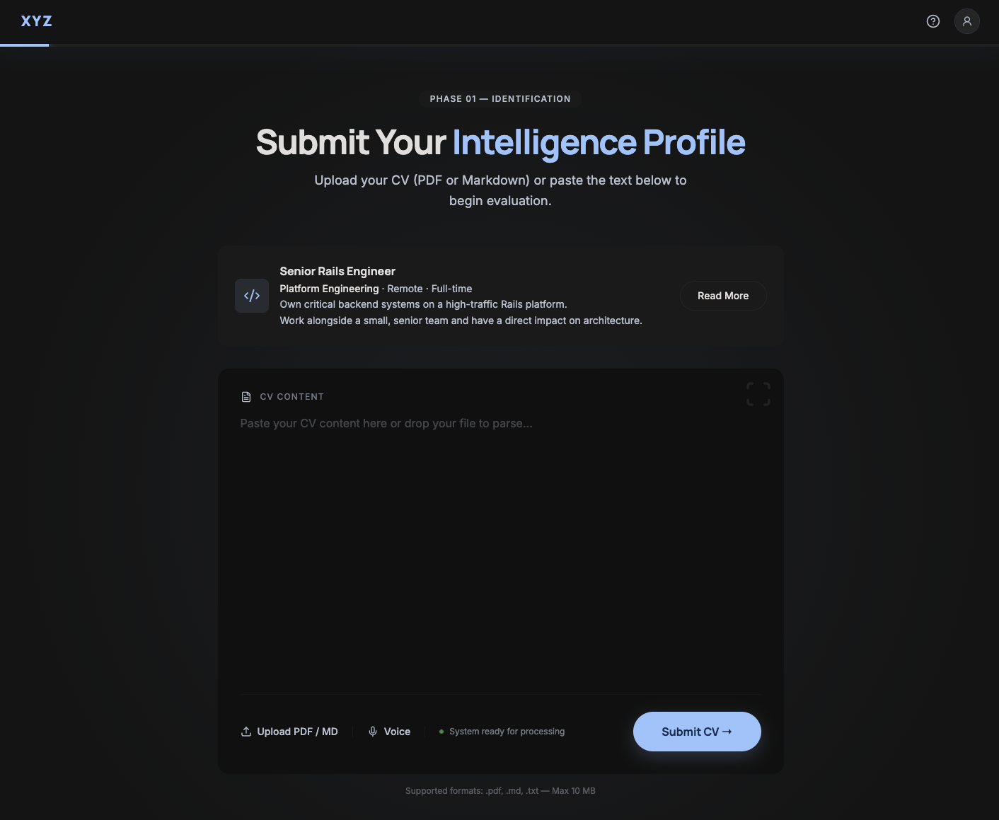
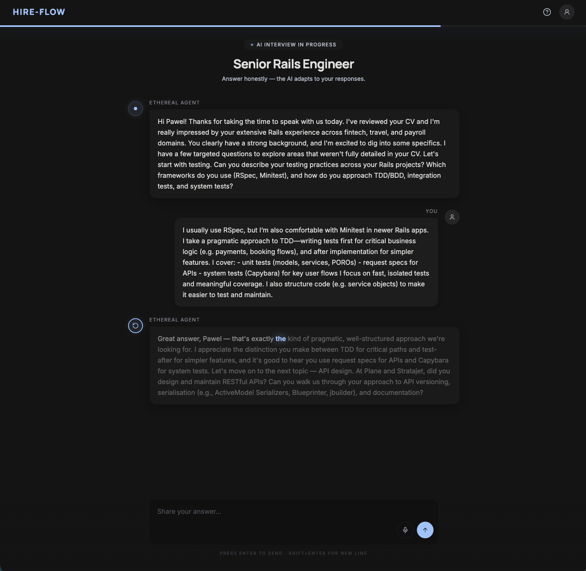
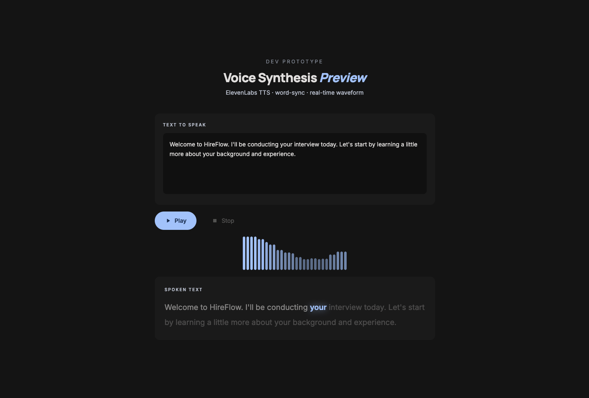
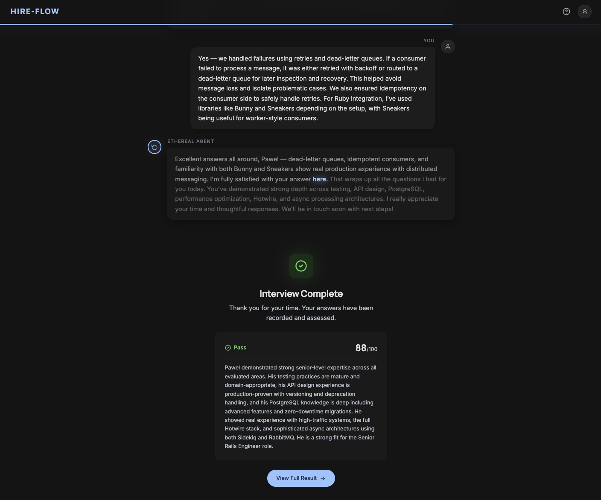
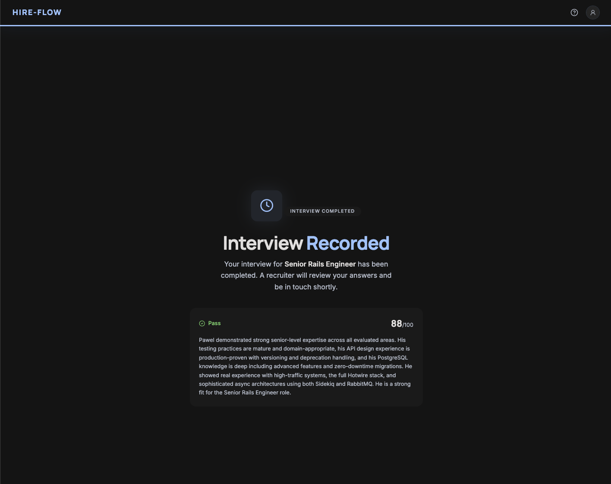
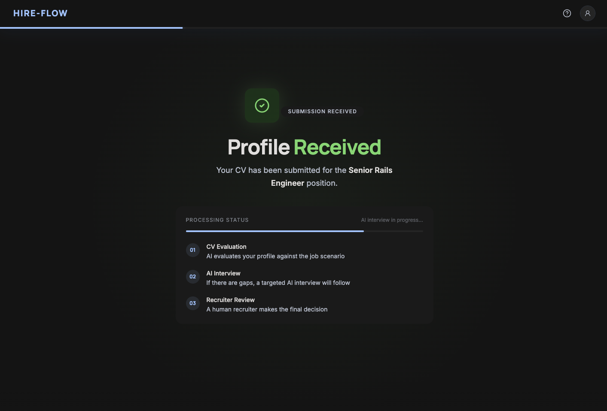
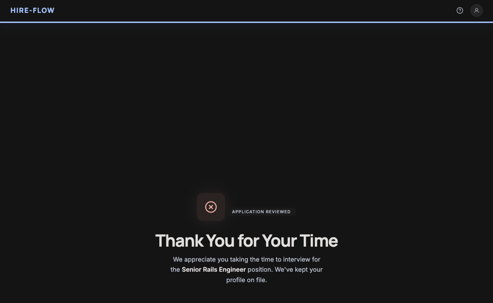

# Modern Applications

AI-powered candidate pre-screening platform. Candidates upload a CV, Claude evaluates it against a job-specific Scenario, and the recruiter receives a scored summary — without manual screening.

**Pipeline:** CV Upload → AI Extraction → AI Evaluation → Scored Summary

See [`OVERVIEW.md`](./OVERVIEW.md) for the full write-up: problem, approach, AI usage, tradeoffs, and next steps.
See [`IDEA.md`](./IDEA.md) for the original product spec, data model, and planned routes.

---

## Pipeline screenshots

### Stage 1 — CV Upload

Candidate submits their name, email, and CV file. The system extracts and evaluates the CV against the job's scenario.



---

### Stage 2 — AI Interview

An adaptive, checklist-driven interview conducted by the AI agent. Questions are generated dynamically based on CV gaps and scenario requirements.



#### Text-to-speech

Every AI message is read aloud via ElevenLabs TTS with word-by-word highlighting. Click the avatar button to play, pause, or replay. Use the mic button for speech-to-text dictation.



#### Interview complete

When all checklist items are resolved the inline summary card appears, showing score, pass/fail verdict, and written assessment alongside the full chat history.



---

### Stage 3 — Scored Summary

After the interview the recruiter sees a full result page with score, overall verdict, written summary, and identified red flags or strengths.



**Pass:**



**Fail / needs review:**



---

## Quick start

```bash
cp config/application.sample.yml config/application.yml
# → fill in ANTHROPIC_API_KEY (required)

./bin/setup        # install deps + prepare DB + seed
mise run up        # start all services
```

App runs at **`https://apl.localhost`**.

---

## Environment variables

Variables live in `config/application.yml` (git-ignored). Use `config/application.sample.yml` as the reference.

| Variable | Required | Description |
|---|---|---|
| `ANTHROPIC_API_KEY` | Yes | Claude API key — get from [console.anthropic.com/settings/keys](https://console.anthropic.com/settings/keys) |
| `ELEVENLABS_API_KEY` | No | ElevenLabs TTS key — required for the TTS prototype and Stage 2 voice output |
| `ELEVENLABS_VOICE_ID` | No | ElevenLabs voice ID to use (defaults to Rachel `21m00Tcm4TlvDq8ikWAM` if unset) |

> After editing `config/application.yml`, restart the server — Figaro loads env vars at boot.

---

## Running the app

```bash
mise run up          # start all services via Overmind (Rails + Vite + Caddy)
mise run down        # stop all services
mise run pull        # git pull + bundle + yarn
```

Individual services if needed:

```bash
bin/rails server -p 3120    # Rails only (port 3120, behind Caddy)
bin/vite dev                 # Vite HMR (port 3066)
caddy run --config Caddyfile # Caddy reverse proxy (port 3110 → apl.localhost)
# sudo caddy run --config ./Caddyfile to install root certificate
```

| Service | Port | URL |
|---|---|---|
| Caddy (public) | 3110 | `https://apl.localhost` |
| Rails | 3120 | behind Caddy |
| Vite HMR | 3066 | `https://vite.apl.localhost` |

---

## Database

```bash
bin/rails db:prepare   # create + migrate (safe to re-run)
bin/rails db:reset     # drop + create + migrate + seed
bin/rails db:seed      # seed only (creates the Senior Rails Engineer job + scenario)
```

---

## Testing

```bash
bin/rails test                              # all unit + integration tests
bin/rails test test/models                  # model tests
bin/rails test test/services               # service tests (WebMock stubs Anthropic)
bin/rails test test/jobs                   # job tests
bin/rails test test/models/candidate_test.rb        # single file
bin/rails test test/models/candidate_test.rb:22     # single test at line
bin/rails test:system                      # Capybara system tests
bin/ci                                     # full CI pipeline (lint + security + tests)
```

Tests stub all Anthropic API calls with WebMock — no real API key needed to run the suite.

---

## Linting & security

```bash
bin/rubocop               # Ruby lint (omakase preset)
bin/brakeman --quiet      # security scan
bin/bundler-audit         # gem vulnerability check
```

---

## Architecture

### Stack

| Layer | Technology |
|---|---|
| Framework | Rails 8.1, SQLite (4 DBs: primary, cache, queue, cable) |
| Background jobs | Solid Queue |
| Frontend | Stimulus + Turbo + Vite |
| CSS | TailwindCSS v4 (CSS-first) + DaisyUI |
| Icons | Iconify (Lucide set) |
| File uploads | Active Storage |
| AI | Anthropic Claude (`claude-opus-4-6`) |
| State machine | Statesman via `statesman_scaffold` |
| Tests | Minitest + WebMock + Capybara |

### Key files

```
app/
  controllers/applications_controller.rb   # CV upload, status polling
  services/cv_processor.rb                 # file → Markdown text
  services/cv_evaluator.rb                 # CV + Scenario → structured result
  jobs/process_cv_job.rb                   # orchestrates extraction
  jobs/evaluate_cv_job.rb                  # orchestrates evaluation
  models/candidate.rb                      # state machine + inquiry predicates
  models/candidate/state_machine.rb        # Statesman states + transitions
  models/job.rb                            # active/closed scopes
config/application.sample.yml             # env var template
db/seeds.rb                               # creates job + scenario
```

### Candidate state machine

```
cv_processing → ready_for_evaluating → evaluating → evaluated
                                                   ↘ rejected
```

Future states: `interviewing → completed → accepted / rejected`

---

## Dev-only prototype pages

These routes exist only in `development` and are not compiled into or accessible in production.

### TTS prototype — `/dev/text_to_speech`

A standalone sandbox for testing ElevenLabs text-to-speech ahead of Stage 2 (AI interview).

**What it does:**
- Type any text, hit Play
- Rails proxies the request to ElevenLabs (`/with-timestamps`) keeping the API key server-side
- Audio plays in the browser via Web Audio API
- Each word lights up in sync as it is spoken (driven by ElevenLabs character-level timestamps)
- A real-time waveform animates from the audio frequency data

**Requires:** `ELEVENLABS_API_KEY` set in `config/application.yml`. Optionally set `ELEVENLABS_VOICE_ID` to use a different voice (defaults to Rachel).

**Implementation files:**
```
app/controllers/dev/text_to_speech_controller.rb   # Rails proxy to ElevenLabs API
app/views/dev/text_to_speech/show.html.erb          # Prototype UI
app/frontend/javascript/controllers/tts_controller.js  # Stimulus: audio + word sync + waveform
```

---

## Development notes

- **Jobs run inline in development** (`perform_now`) so you don't need a Solid Queue process running. This means the HTTP request blocks for ~10–30 s while Claude processes. In production, jobs run async via `perform_later`.
- **PDF extraction uses Claude** — plain text/Markdown files are read directly with no API call.
- **The Scenario document drives all evaluation logic** — to change how candidates are scored, edit the scenario in `db/seeds.rb` (or via Rails console) and re-seed. No code changes needed.
- **Mocking and stubbing are fine** — tests stub Anthropic at the HTTP level. Partial implementations and TODO stubs are acceptable in this codebase.

---

## License & Usage

This project is free to use for personal and commercial purposes.

You are welcome to use, modify, and build upon this project. However, if any part of this project (code, idea, architecture, or concept) is used in another project, proper attribution is required.

Attribution should include:
- Mentioning the original author (Paweł Niemczyk)
- Providing a link to the source repository: https://github.com/pniemczyk/hireflow

Example attribution:
> Based on or inspired by Hireflow by Paweł Niemczyk — https://github.com/pniemczyk/hireflow

Failure to provide attribution is not permitted under these terms.

---

## Changelog

See [`CHANGELOG.md`](./CHANGELOG.md) for a history of notable changes.
